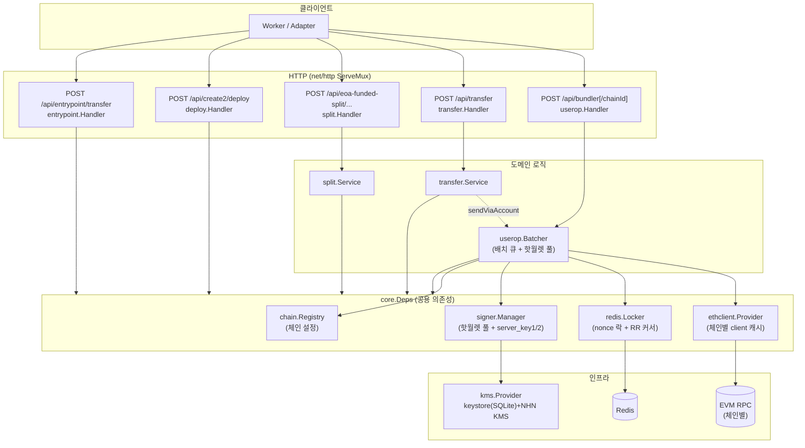
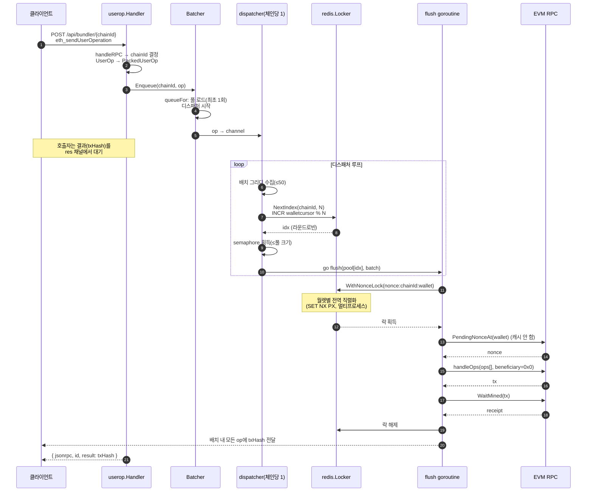
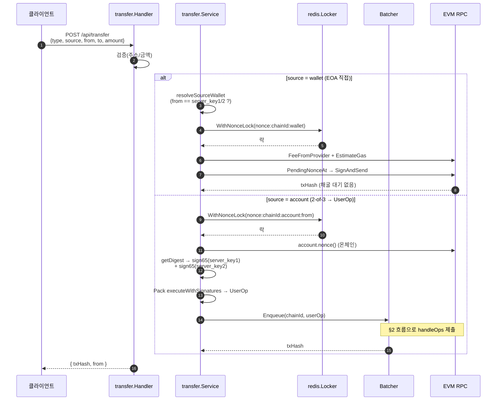
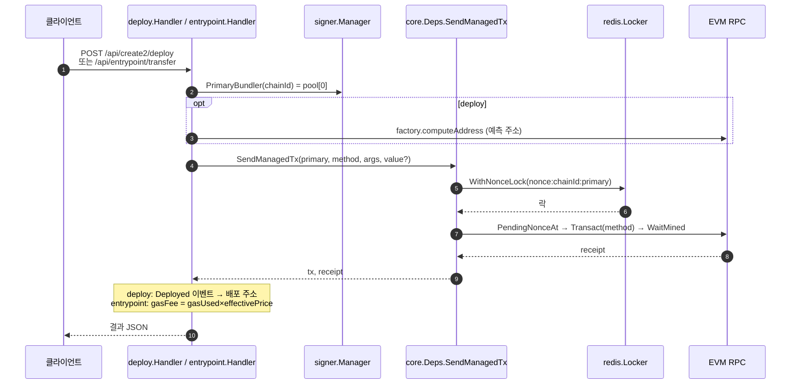
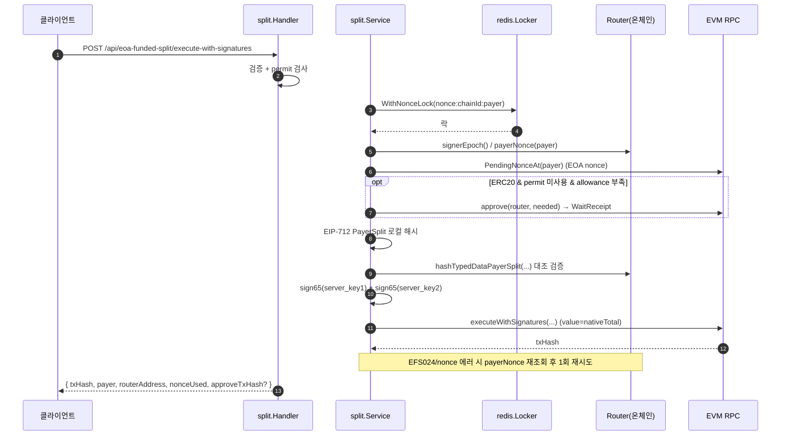
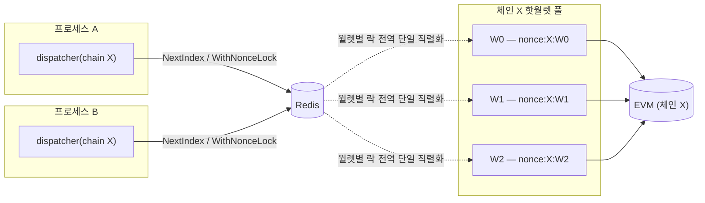

# 아키텍처 (Go 멀티번들러)

기존 Next.js(TS) 번들러를 Go로 이식하고, 멀티프로세스에서 안전하게 동작하는
**체인별 핫월렛 풀 + redis 분산 nonce 락** 구조로 재설계했다.

- 도메인별 납작 패키지(`internal/<domain>`) + 인프라(`internal/platform/*`)
- 공용 의존성은 `internal/core.Deps`로 1회 조립해 주입
- `userop` 배치 큐와 `transfer`(sendViaAccount)는 **하나의 `Batcher`를 공유**

---

## 1. 컴포넌트 구조

---

## 2. 핵심 흐름: `eth_sendUserOperation` (멀티번들러)

체인당 디스패처 1개가 op를 배치로 모으고, **redis 라운드로빈 커서**로 핫월렛을 골라
`handleOps`를 보낸다. 서로 다른 월렛은 nonce 락이 독립이라 동시 제출된다.

> 실패 시 `platform/txerror.Normalize`로 분류해 JSON-RPC `error.data`에
> `{code, category, ethersCode, txHash, retryable}`를 담는다.

---

## 3. 전송: `POST /api/transfer`

`source=wallet`은 server_key1/2로 직접 서명, `source=account`는 2-of-3 서명 UserOp를
같은 Batcher로 제출한다.

---

## 4. 결정론 작업: deploy / entrypoint (PrimaryBundler 고정)

배포 주소는 deployer에 의존하므로 라운드로빈하지 않고 풀의 `[0]`(PrimaryBundler)을 쓴다.

---

## 5. 정산: EOA-funded-split (EIP-712)

payer(server_key1/2) EOA가 트랜잭션·자금 출처. server_key1·2가 PayerSplit을 EIP-712 서명.

---

## 6. 멀티프로세스 동시성 모델

- **선택**: `walletcursor:{chainId}` redis INCR → 풀을 라운드로빈 (전역 분산)
- **직렬화**: `nonce:{chainId}:{wallet}` 락 — 어느 프로세스가 어느 월렛을 쓰든 그 월렛의
  nonce 줄은 전역에서 하나로 직렬화. nonce는 캐시하지 않고 락 안에서 온체인 pending을 읽는다.
- **병렬성**: 서로 다른 월렛은 락이 독립 → 체인당 동시 in-flight tx = 풀 크기 N
- redis 미설정 시 둘 다 프로세스 내 폴백(단일 인스턴스 전용)

검증: `internal/userop/batcher_test.go`
(라운드로빈 분산 / 월렛별 직렬화 / 교차 월렛 병렬성 / nonce 무충돌, `go test -race`).
